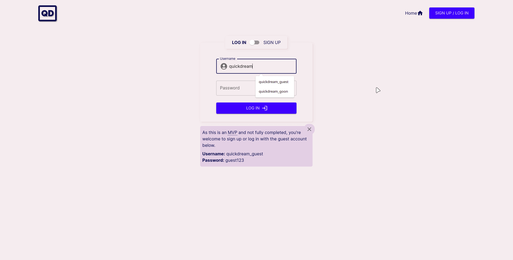

# Quickdream
Quickdream is a full-stack social media app created to explore the capabilities of AI image generation and OpenAI's public API in general. Users are able to enter a prompt and have an image generated based on that prompt. These images are then shared on the Quickdream platform, where users can follow each other, like and comment on images, and discover new and interesting prompts to try. 

**The app has just entered the minimum viable product stage, so some promised features are still being built out.** 

 

**Link to project:** https://quickdream.netlify.app/

## How It's Made:

**Tech used:** HTML, CSS, JavaScript, React, Vite, MUI, Express, MongoDB, JSON Web Tokens

The front end is created with `React`, `MUI`, and `CSS`. `MUI` was primarily used for form inputs, buttons, and icons.
The back end uses `Express` as the foundation for the server, and `MongoDB` + `Mongoose` for storing the application's data, while
`bcrypt` is used to hash/salt user passwords before being stored in the database. The `OpenAI` API library is used to generate images from a prompt that are then uploaded to `cloudinary` and stored.
After signing up, users are given a default user avatar that is dynamically generated by the `identicon` package based on their username.
The `Passport` library was recently replaced with JSON Web Tokens using the `jsonwebtoken` library to improve the code's readability and maintainability.
## Lessons Learned:
I approached this project with a new methodology in mind. Rather than ideating and designing pages or components, I started the design process by thinking of the features I wanted to include in the project, and designing the application around them. After I had a rough wireframe, I developed in cycles, tweaking a feature's design, developing the feature, tweaking the next feature's design, developing the next feature. 

This feature-first approach has been tremendously helpful in keeping me focused and my ideas grounded. Following this approach, I only create components or new pages when a certain feature warrants them. This is in contrast to my usual practice of building components I think I'll need and then later shoving them into the app somewhere just so they don't go to waste.

This approach also helped create a clear, linear path of development, as it was easy to rank features by their criticality and prioritize building the most critical features first.